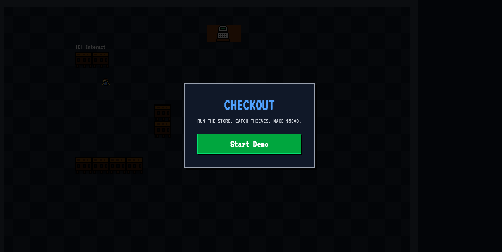
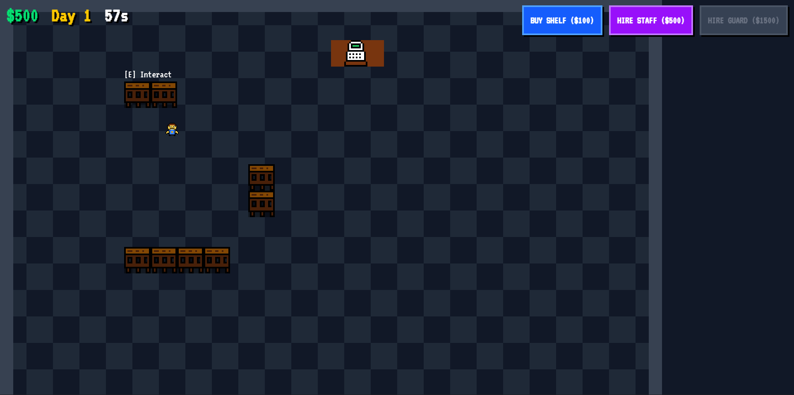

# checkout 🛒

a top down store management tycoon where u run a shop, stock shelves, hire employees, and catch shoplifters before they steal ur stuff. reach $5000 to win.

## why i made this
had a project to submit and wanted to build a full tycoon game loop from scratch using just react and canvas. no game engine, no libraries, just vibes.


## IMAGES


## how to play it
- use wasd to move around ur store
- walk near a shelf and press E to assign products or restock
- walk near the checkout and press E to serve waiting customers
- click "Buy Shelf" to place new shelves around ur store
- hire staff to auto-restock empty shelves
- hire guards to chase down shoplifters (red glow = thief)
- survive each 60 second day and don't go bankrupt
- hit $5000 cash and u win the demo

## features
- custom 2d canvas rendering engine with pixel art sprites
- aabb collision system for player, customers, and employees
- ai state machines — customers shop, thieves steal, guards patrol and chase
- stock boy ai that auto detects and restocks low shelves
- dynamic shelf placement with grid snapping
- day/night cycle with revenue and expense tracking
- main menu, win screen, and game over screen
- procedural audio sfx using web audio api (no audio files)

## how to use the code
1. clone the repo:
```bash
git clone https://github.com/FBIopeningUPP/Checkout.git
```
2. navigate into the client folder:
```bash
cd Checkout/client
```
3. install dependencies:
```bash
npm install
```
4. run dev server:
```bash
npm run dev
```
5. open http://localhost:5173 in ur browser

## ai usage
used ai for fixing my vercel production and debug all the a physics

## tech stack
- react + vite
- zustand (state management)
- html5 canvas (rendering)
- web audio api (sound effects)
- tailwind css (ui)
